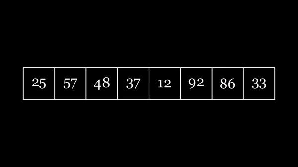

# Data Structures and Algorithms Visualization with Manim

This project demonstrates various Data Structures and Algorithms (DSA) using the Manim animation engine. It provides step-by-step visualizations of popular algorithms such as sorting, searching, and more complex data structures like trees and graphs.

--------

## Table of Contents
- [Introduction](#introduction)
- [Installation](#installation)
- [How to Run](#how-to-run)
- [Available Visualizations](#available-visualizations)

## Introduction
This project leverages [Manim](https://github.com/ManimCommunity/manim) to animate various Data Structures and Algorithms (DSA). The goal is to help learners understand how algorithms work by providing visual aids and intuitive step-by-step breakdowns.

The algorithms currently visualized include:
- Sorting Algorithms: QuickSort,SelectionSort

## Installation

To run the visualizations, you'll need Python and Manim installed. Follow the steps below:

1. **Clone the repository**:
   ```bash
   git clone https://github.com/your-username/dsa-visualization.git
   cd dsa-visualization
2.**Install Manim**:
    ```bash 
    pip install manim

## How To Run
    pql flag helps in rendering fast but at lower quality.
    ```bash
        manim -pql quicksort.py QuickSortManim


## Available Visualization
